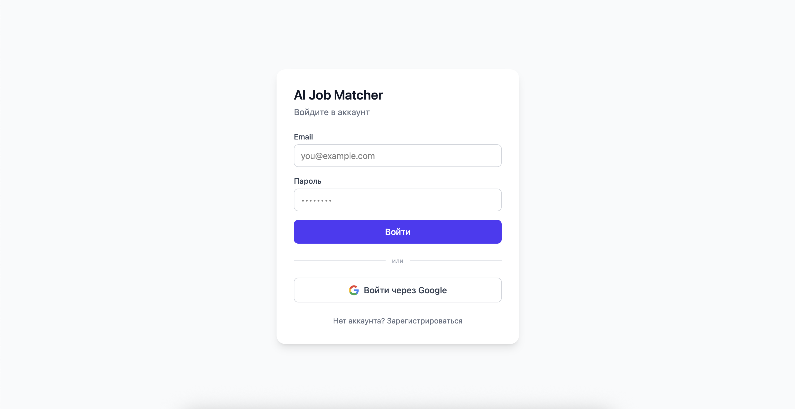
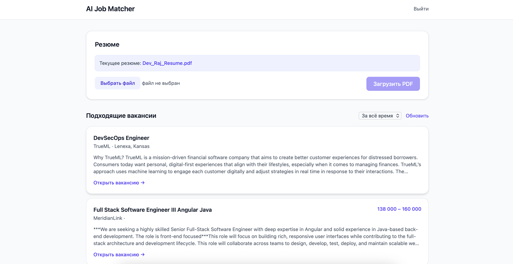

# AI Job Matcher


Сервис семантического подбора IT-вакансий под резюме. Пользователь загружает PDF-резюме, оно превращается в векторное представление, и система находит наиболее близкие вакансии через поиск по векторам (pgvector). Вакансии автоматически собираются с RemoteOK по расписанию.

## Возможности

- Регистрация и аутентификация по email/паролю, а также через Google OAuth2
- Загрузка PDF-резюме с извлечением текста и построением эмбеддинга
- Семантический матчинг резюме и вакансий через косинусную близость векторов (pgvector)
- Фильтр подобранных вакансий по свежести (за последние N часов)
- Фоновый парсинг вакансий, рассылка подборок на email и очистка устаревших вакансий (Celery + beat)
- Веб-интерфейс на React (логин, загрузка резюме, список вакансий)

## Безопасность

- JWT access-токены (короткоживущие) + refresh-токены, хранящиеся в БД в виде SHA-256 хешей
- Ротация refresh-токенов при каждом обновлении
- Детект переиспользования refresh-токена (token reuse detection): при предъявлении уже отозванного токена отзывается вся цепочка сессий пользователя
- Logout и logout-all (выход со всех устройств)
- Rate limiting на эндпоинтах аутентификации (по IP и по email) через slowapi + Redis
- Валидация загружаемых файлов: content-type, расширение, размер, magic bytes
- Структурное логирование событий безопасности с маскированием персональных данных
- Защита от user enumeration (единый ответ для несуществующего email и неверного пароля)

## Стек

**Backend:** FastAPI, SQLAlchemy (async), PostgreSQL + pgvector, Alembic
**Очереди и кеш:** Celery, RabbitMQ, Redis
**Хранилище файлов:** MinIO (S3-совместимое)
**ML:** fastembed (модель bge-small-en-v1.5, 384-мерные эмбеддинги)
**Аутентификация:** python-jose (JWT), Authlib (OAuth2), passlib (bcrypt)
**Frontend:** React, Vite, TailwindCSS, axios
**Инфраструктура:** Docker Compose, Nginx
**CI:** GitHub Actions (pytest на каждый push и pull request)

## Архитектура

Модульный монолит. Каждый домен разбит на слои: роутер (HTTP) → сервис (бизнес-логика) → репозиторий (доступ к данным).

```
app/
  auth/       регистрация, JWT, OAuth2, refresh-токены
  jobs/       CRUD вакансий
  resumes/    загрузка PDF, извлечение текста, эмбеддинги
  matching/   поиск похожих вакансий
  tasks/      Celery-задачи (парсинг, рассылка, очистка)
  core/       конфиг, БД, зависимости, сервисы (storage, pdf, embedding, email)
frontend/     React + Vite SPA
nginx/        reverse proxy
alembic/      миграции БД
tests/        pytest
```

## Основные эндпоинты

| Метод | Путь | Назначение |
|-------|------|------------|
| POST | `/auth/register` | Регистрация |
| POST | `/auth/login` | Вход, выдача пары токенов |
| POST | `/auth/refresh` | Обновление токенов с ротацией |
| POST | `/auth/logout` | Выход (отзыв одного refresh-токена) |
| POST | `/auth/logout-all` | Выход со всех устройств |
| GET | `/auth/google` | Старт Google OAuth2 |
| GET | `/auth/me` | Текущий пользователь |
| POST | `/resumes` | Загрузка PDF-резюме |
| GET | `/resumes/me` | Текущее резюме |
| GET | `/jobs` | Список вакансий |
| GET | `/matching/jobs?hours=24` | Подобранные вакансии, опционально по свежести |

## Запуск

Требуется Docker и Docker Compose.

```bash
# 1. Создать .env (см. переменные в app/core/config.py)
cp .env.example .env   # затем заполнить значения

# 2. Поднять сервисы
docker compose up -d --build

# 3. Применить миграции
docker compose exec app alembic upgrade head
```

API доступен на `http://localhost:8000`, документация — `http://localhost:8000/docs`.

Frontend (dev-режим):

```bash
cd frontend
npm install
npm run dev
```

Интерфейс — `http://localhost:5173`.

## Тесты

```bash
docker compose exec app pytest tests/ -v
```

Покрытие: аутентификация, ротация и реюз refresh-токенов, logout, загрузка резюме, матчинг, права доступа к вакансиям.

## Скриншоты




## Возможные улучшения

- Перенос конфигурации хостов (frontend/backend URL) из кода в settings для деплоя
- Хранение refresh-токена в HttpOnly cookie вместо localStorage (защита от XSS)
- Нормализация кодировки описаний вакансий на этапе парсинга
- Расширение покрытия тестами Celery-задач
